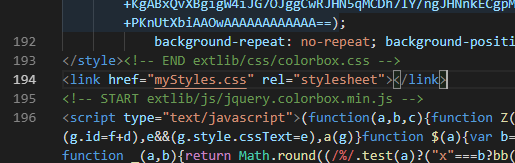

MyNote
======
https://HijiriIshi.github.io/note

## Install
Localで使用する場合
1. `\bin\`直下に`caddy`を配置
https://caddyserver.com/
2. `run.bat`実行

## Thanks!
MDwiki http://dynalon.github.io/mdwiki/#!index.md

## memo
`mdwiki.html`を`index.html`に改名

`index.html`に以下の編集を加えることにより独自スタイルシート読込
```<link href="myStyles.css" rel="stylesheet"></link>```

